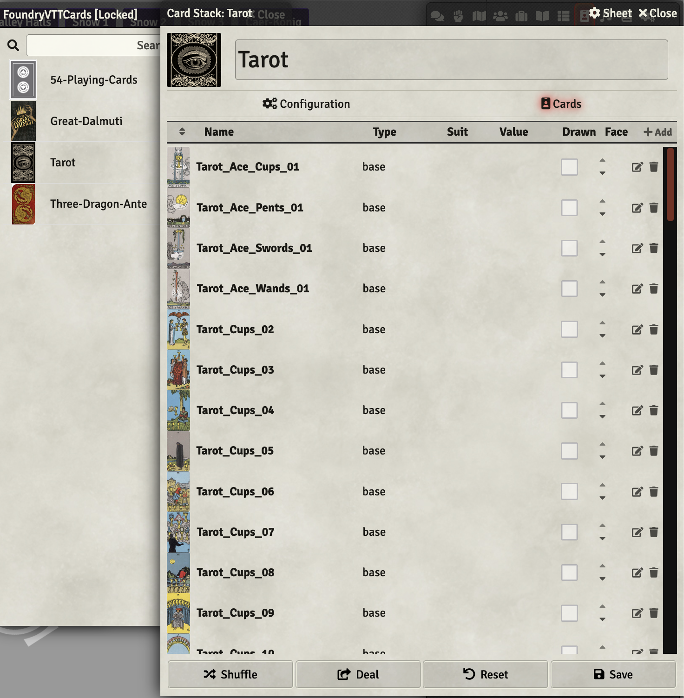

# Great Dalmuti (and other examples) deck of cards for Foundry VTT

## To Install in your Foundry v9 instance

Go to the **Setup** area of Foundry VTT.
Click on the **Add-on Modules** tab.
Click on the **Install Module** button.
Paste this url in the **Manifest URL** field.
Click on the **Install Module** button.

Three new card decks will be available for you to import from a compendium with the name **FoundryVTTCards**.

Happy Gaming!



## Development information

### make the deck(s)

```shell
./make.sh
```

### Re-deploy

```shell
cd ~/foundryvtt_test/Data/modules/FoundryVTTCards && \
sudo rm -Rf * && \
sudo unzip ~/FoundryVTTCards.zip && \
sudo chown -R foundry.foundry ../FoundryVTTCards && \
docker container restart foundryvtt_test
docker logs foundryvtt_test --follow | grep -i card
```
